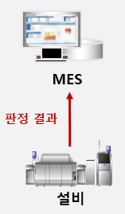
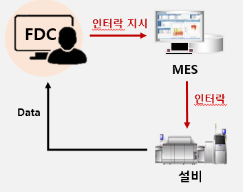
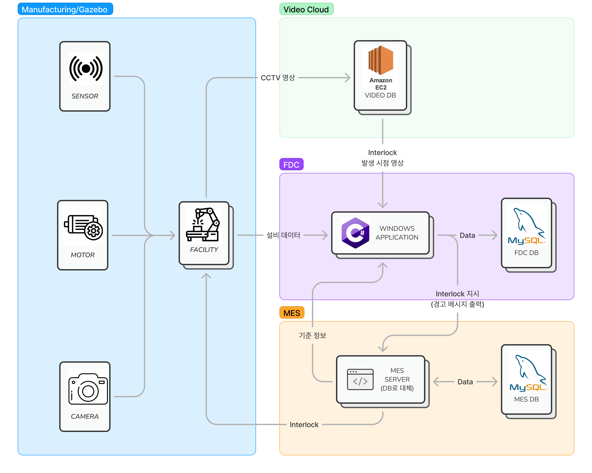

# 🏭 배터리 제조 기술 설비 이상 감지 시스템(FDC 시스템) - 삼성 SDI 연계 PJT

## 프로젝트 진행 기간

2023.04.10(월) ~ 2023.05.26(금)  
SSAFY 8기 2학기 삼성 SDI 연계 프로젝트 - 배터리 제조 기술 설비 이상 감지 시스템(FDC 시스템)

## 🚩 배터리 제조 기술 설비 이상 감지 시스템 - 배경

- MES에 판정 결과만 보고하는 구조적 한계점
- 설비 자체에만 의존하는 양불 판정 => 설비 판정 오류시 불량 제품 유출 초래

## 🚩 S배터리 제조 기술 설비 이상 감지 시스템 - 개요

- 설비 데이터 실시간 모니터링
- 설비 데이터 모니터링 후 설비 인터락 제어

## 🚩 주요 기능

1. JSON Data의 자료형 추출

   - DFS를 통해 자료형을 재귀적으로 추출

2. 전체/즐겨찾는 API에 대한 Response의 Pass/Fail Trend 시각화

   - 일/주/월 단위의 모니터링 결과를 Chart.js를 활용하여 시각화

3. 개별 API에 대한 상세정보 보기

   - 모니터링 하고 있는 API Request 정보와 Raw JSON Data Response 및 Response의 Schema 확인 가능

4. 서로 다른 두 시점의 API 응답 내용 비교 (diff)

   - 두 Raw JSON Response 비교 시 달라진 부분을 스크롤 바 옆에 색깔로 표시

## 🚩 시스템 아키텍처

1. Language

   - C#
   - C++

2. Framework

   - WPF

3. DB

   - Firebase
   - MySQL

4. OS

   - Windows
   - Linux

5. Server

   - AWS EC2
   - Nginx

6. CI/CD

   - Jenkins
   - Docker

7. Test

   - Sonarqube

8. etc

   - GAZEBO

## 🙆 협업 툴

- GitLab
- Notion
- JIRA
- MatterMost

## 🙆 협업 환경

- Gitlab
  - 코드 버전 관리
  - Jira와 연동하여 일정 관리
  - 커밋 컨벤션 준수

- JIRA
  - 매주 일정에 따른 업무를 할당하여 Sprint 진행
  - JIRA 컨벤션 준수

- 회의
  - 아침마다 스크럼 회의 진행
  - 주별로 전 파트 코드리뷰 진행
  - 그라운드 룰 준수

- Notion
  - 각종 문서 아카이빙과 회의록 보관
  - 기능명세서, 이해관계자, 유즈케이스 시나리오 등 문서 보관
  - 코딩 컨벤션 정리
  - 프로젝트 일정 정리
  - 그라운드 룰 명시

## 🙆  팀원 역할 분배

### Window App

- 정의권
- 최명서

### Virtual Factory

- 채민기
- 김지선
- 조성환
- 임상빈

## 🚩 프로젝트 산출물

- [기능명세서](https://www.notion.so/d1bcb42a033d46c7838edb56479709e6)
- [ERD](https://www.erdcloud.com/d/Tvv7ZHNJaBfunhA4R)
- [Wireframe](https://www.figma.com/file/O4j5CtW00BeuhHcqGGodPV/%EB%B0%B0%ED%84%B0%EB%A6%AC-%EC%A0%9C%EC%A1%B0-%EC%84%A4%EB%B9%84-%EC%9D%B4%EC%83%81-%EA%B0%90%EC%A7%80-%EC%8B%9C%EC%8A%A4%ED%85%9C-%EA%B5%AC%EC%B6%95?node-id=1-3&t=Y9BnjpzipoTmGEQo-0)

## 🚩: 프로젝트 결과물

